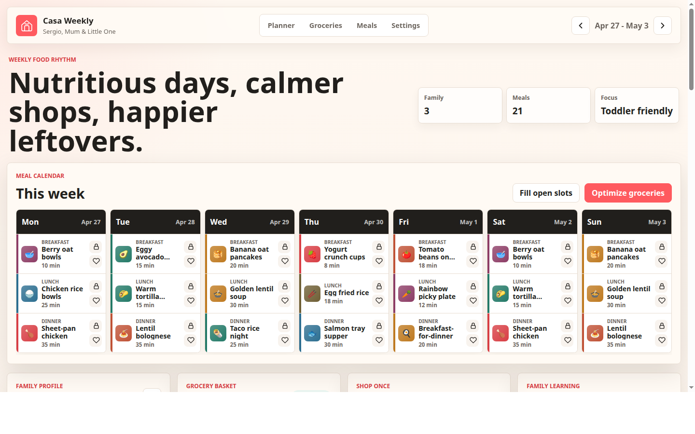

# Casa Weekly



A family weekly meal planner for breakfast, lunch, and dinner ideas. It is designed around three goals:

- keep meals nutritious and toddler friendly
- reuse weekly groceries before buying more
- make planning feel warm, quick, and family specific

## Run

Open `index.html` in a browser.

No build step or package install is required.

## Test

```bash
npm test
```

The test suite runs a JavaScript syntax check and a dependency-free Chromium end-to-end smoke test.

## What It Includes

- 7-day calendar with breakfast, lunch, and dinner slots
- meal swaps, shuffle, lock, and fill-open-slots controls
- family dietary toggles and an avoid list
- grocery basket with local ingredients
- computed shopping list based on planned meals
- grocery reuse score and shared-staple insight
- per-week meal plans keyed by Monday week start
- family learning for favourites, skips, and planning notes
- friendly weekly helpers for grocery reuse, toddler fit, weekly rhythm, and learning
- family settings for home style, household context, planning promises, and learned preferences
- markdown starter files in `family-guide/` for the underlying guide structure
- local browser persistence through `localStorage`

## Framework

Casa Weekly is built as a local-first personalised planning loop:

1. Guide: home style, household context, planning promises, and family learning
2. Observe: groceries, week, meals, dietary needs, avoid list, and feedback
3. Learn: favourites, skips, notes, and taste profile
4. Plan: score meals and keep separate weekly plans
5. Explain: show weekly helper cards and a family guide preview

See [docs/FRAMEWORK.md](docs/FRAMEWORK.md) for the full architecture and [docs/AUDIT.md](docs/AUDIT.md) for the current project audit.

## Family Guide Model

Casa Weekly uses a four-part family guide model, but keeps the app language simple:

- `family-guide/SOUL.md` → Home style
- `family-guide/USER.md` → Household
- `family-guide/AGENTS.md` → Planning promises
- `family-guide/MEMORY.md` → Family learning

These are standalone starter templates for this project. The app does not read or import settings from any other local system. It stores the live version locally in the browser and lets you preview or download a plain-text family guide from Settings.
